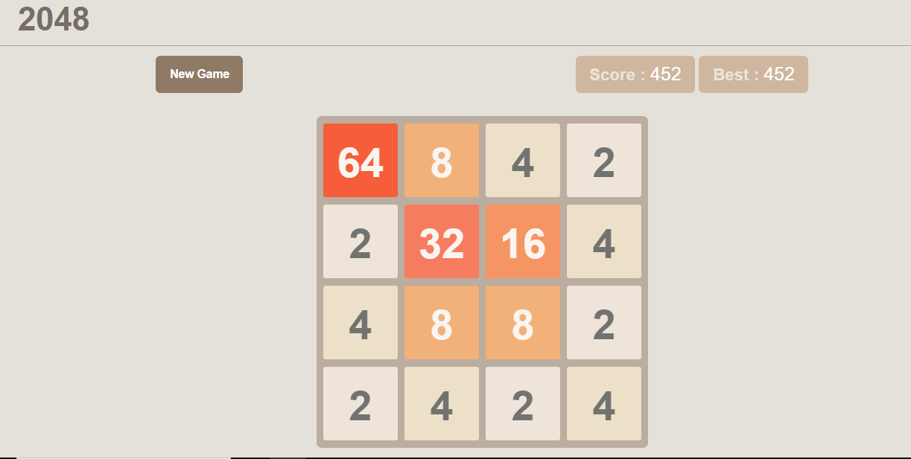

# 2048

Join the tiles, get to 2048!
HOW TO PLAY: Use your arrow keys to move the tiles. Tiles with the same number merge into one when they touch. Add them up to reach 2048! and win . you will loose when grid is full and no merge can take place .

DEMO :- https://prasanbora.github.io/2048/