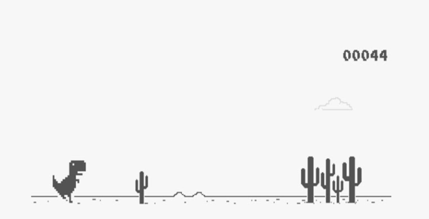

#Chrome Dino Game
This is a simple implementation of the Chrome Dino Game using JavaScript and DOM manipulation. The project mimics the classic dinosaur running game that appears in Chrome when the user is offline. In this game, the dinosaur jumps over obstacles, and the player's score increases as they survive longer.

Technologies Used
HTML5: Markup for the game structure.
CSS3: Styling for the game elements and layout.
JavaScript (DOM Manipulation): Core logic for handling game interactions, animations, and obstacle generation.
